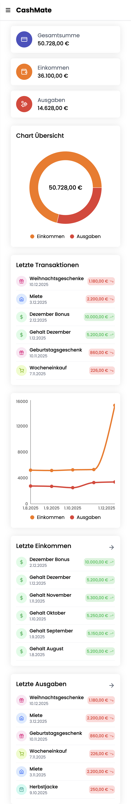
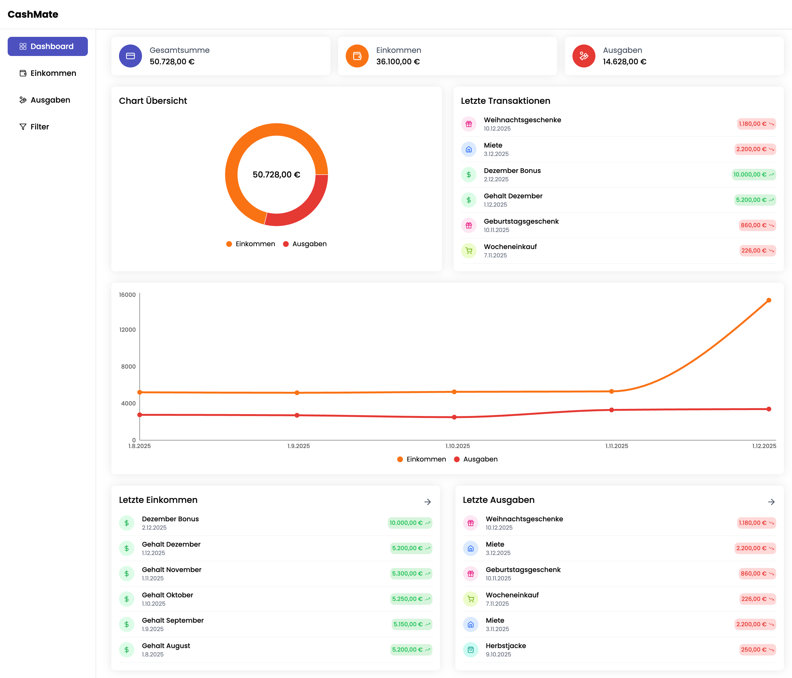
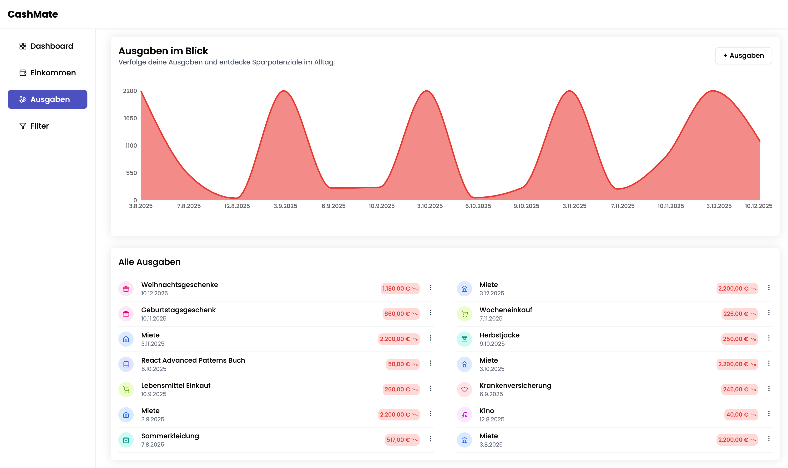
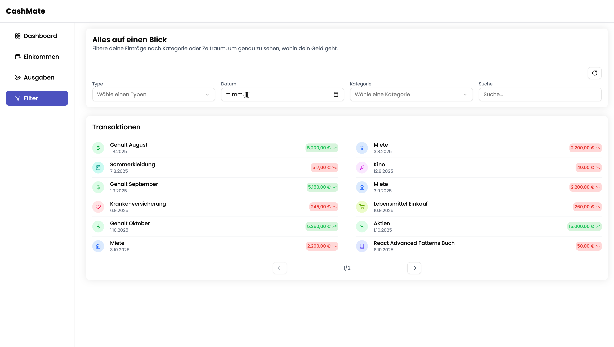

# 📉 Cashmate - Expense Manager

Cashmate is an interactive and minimalistic expense management dashboard designed to help users track and analyze their daily financial activity.

## 🚀 Live Demo
[Live Demo](https://home-5019181819.app-ionos.space/)

## 📌 Features
- Add / edit / delete transactions
- Dashboard with charts
- Local storage persistence
- Smooth UI with shadcn components
- Responsive layout (mobile + desktop)
- Pagination

## 🛠 Tech Stack
- Typescript
- React
- Zustand
- react-hook-form + zod
- shadcn/ui
- Tailwind CSS
- LocalStorage

## 📚 What I Learned
### TypeScript
- Defining and organizing types
- Optional props
- Improving data safety
- TypeScript fundamentals
- Structuring a real app with strict typing
### React Architecture
- UI logic vs business logic
- Store-driven architecture with Zustand
- Clean component organisation
- Pagination and sorting logic
### Forms & Validation
- Building complex forms with react-hook-form
- Schema-based validation with zod
- Transforming data through enriched UI arrays
### UI / UX
- Using shadcn/ui efficiently
- Reusable components
- Responsive layouts
- Clean UI composition
### General
- Refactoring the income/expense pages into one unified transaction page
- How to structure UI arrays for clean mapping
- How to build a maintainable, scalable front-end

## Screenshots

### Mobile

### Desktop

## 📝 Note
This is my first TypeScript project.
I built it to practice real-world architecture, state management, data modeling, and UI patterns. It helped me understand many new concepts and improve my confidence working with TypeScript in React.